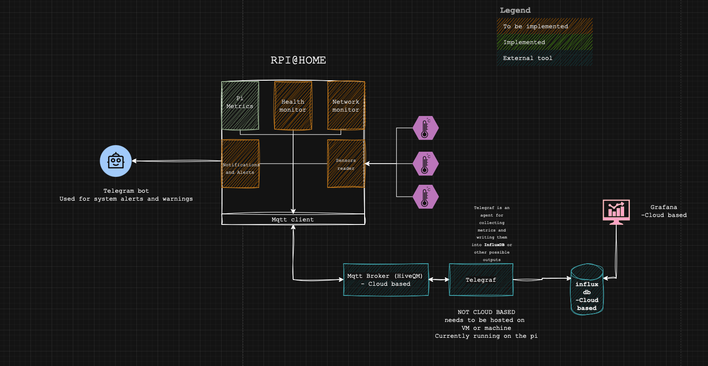

# rpi-Home

**RPi@Home** is a plug-and-play Raspberry Pi IoT device for your home. It is designed to run multiple modular services that collect, process, and publish data about your home environment or the Pi itself.  



---

## Features

- **Plug & Play:** Easy setup on any Raspberry Pi.
- **Modular Services:** Each service runs independently as a `systemd` service.
- **Setup Script:** Each service comes with a `setup.sh` for provisioning the service and generic `setup.sh` to provision the device.
- **Expandable:** Future services can be added without modifying existing ones.
- **Logging:** Each service logs its activity locally.

## Current Services

### Pi Metrics
- Collects CPU, memory, storage, uptime, and network traffic.
- Publishes data via MQTT.
- Runs as a `systemd` service for automatic startup.
- Logs metrics and activity to local log files.

## Installation

1. Clone the repo
2. For each service check the ```.env.example ``` file and configure it 
3. For each service, run its ```setup.sh```:
```sh Services/{Servicename}/setup.sh```
  This will do the following:
  - Update the system
  - Install python and pip
  - Create virtual envitonment.
  - Copy ```.env.example``` to ```.env``` if it dosent exist.
  - Install python ```requirements.txt```
  - Create and enable the ```systemd``` serive.
  - Start the service
   


## Future Services/Roadmap
- Support physical sensors (tempreture, humidity,..etc)
- Notification and Alerts service
- Device Manager
- Update Manager (OTAU)
- Telegram bots for alerts

