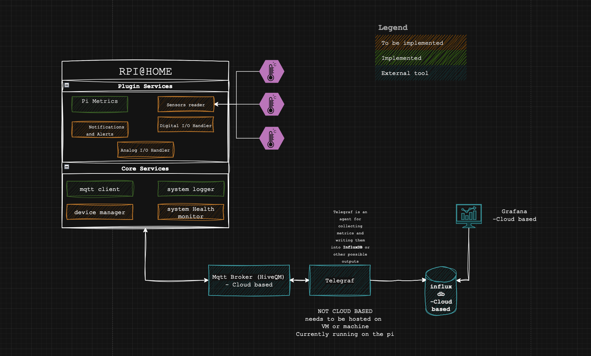

# rpi-Home

**RPi@Home** is a plug-and-play Raspberry Pi IoT device for your home. It is designed to run multiple modular services that collect, process, and publish data about your home environment or the Pi itself.  



## Features

- **Plug & Play:** Easy setup on any Raspberry Pi.
- **Modular Services:** Each service runs independently as a `systemd` service.
- **Setup Script:** Each service comes with a `setup.sh` for provisioning the service and generic `setup.sh` to provision the device.
- **Expandable:** Future services can be added without modifying existing ones.
- **Logging:** Each service logs its activity locally.

---
## 🧩 Architecture Overview

**RPi@Home** is built around two main layers of services:

---

### 🧠 Core Services
Core Services provide the essential infrastructure — MQTT communication, logging, device management, and service health monitoring.  
They act as the backbone of the system that all plugin services depend on.

#### Core Services Overview
| Service | Description | Status |
|----------|--------------|---------|
| **MQTT Client** | Handles publishing and subscribing to MQTT topics. Provides a unified interface for communication between services. | ✅ Implemented |
| **System Logger** | Centralized logging utility used across all services for consistent log formatting and storage. | ✅ Implemented |
| **Device Manager** | Manages device metadata, hardware information, and general configuration. | 🚧 To be implemented |
| **Service Health Monitor** | Monitors the status and uptime of running services to ensure reliability and detect failures. | 🚧 To be implemented |
| **Update Manager (OTAU)** | Enable over-the-air updates for services and system components.. | 🚧 To be implemented |


---

### 🧩 Plugin Services
Plugin Services extend the system’s functionality by adding domain-specific features.  
They can be added or removed independently without affecting the core infrastructure.

#### Plugin Services Overview
| Service | Description | Status |
|----------|--------------|---------|
| **Pi Metrics** | Collects CPU, memory, storage, uptime, and network usage metrics. Publishes data via MQTT. | ✅ Implemented |
| **Sensors Reader** | Reads data from external sensors (e.g., temperature, humidity, or light). | 🚧 To be implemented |
| **Notifications & Alerts** | Sends notifications or alerts based on events or thresholds (via MQTT, Telegram, etc.). | 🚧 To be implemented |
| **Digital Pins Handler** | Manages Raspberry Pi GPIO digital input/output pins. | 🚧 To be implemented |
| **Analog Pins Handler** | Handles analog input and output operations (e.g., ADC/DAC sensors and devices). | 🚧 To be implemented |

---

This modular structure makes **RPi@Home**:
- **Scalable:** New services can be added easily  
- **Maintainable:** Each service is independent and replaceable  
- **Reliable:** Core infrastructure is stable and shared across modules


## Installation

1. Clone the repo
2. For each service check the ```.env.example ``` file and configure it 
3. For each service, run its ```setup.sh```:
```sh Services/{Servicename}/setup.sh```
  This will do the following:
  - Update the system
  - Install python and pip
  - Create virtual envitonment.
  - Copy ```.env.example``` to ```.env``` if it dosent exist.
  - Install python ```requirements.txt```
  - Create and enable the ```systemd``` serive.
  - Start the service
   


